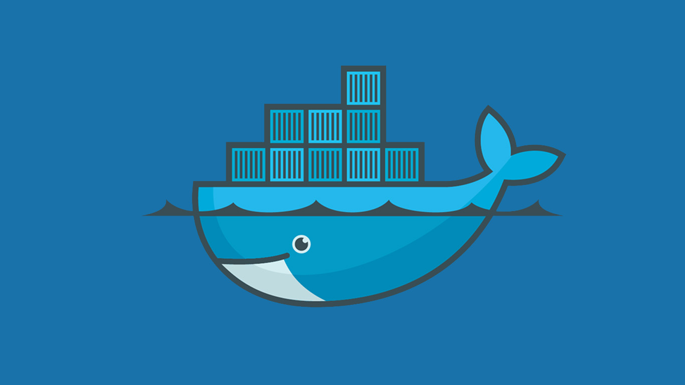

<h1 align='center' id='Título-e-Imagem-de-capa'>Docker Todo List</h1>

<p align='center'>

</p>


## Bradges

<p align='left'>
</img>


## Execução

### Para instalar o projeto na sua máquina, faça antes o clone do repositório

### Para clones com HTTPS:

```bash
  git clone https://github.com/viniciusjosedev/project-docker-todo-list.git
```

### Para clones com SSH:

```bash
  git clone git@github.com:viniciusjosedev/project-docker-todo-list.git
```

### Para clones com GitHub CLI:

```bash
  gh repo clone viniciusjosedev/project-docker-todo-list
```

### Depois de clonado, abra a o terminal na raiz do projeto e rode o seguinte comando:

```bash
  npm install
```

### Pronto! Com isso a aplicação irá rodar na sua máquina localmente.

## Descrição do projeto

### Primeiro projeto de backend realizado mediante a necessidade de praticar os conhecimentos adquiridos anteriormente de forma teórica. Este projeto em específico se trata de uma série de comandos utilizados na ferramenta docker, dockerfile e docker-compose.

## :computer: Tecnologias/Linguagens utilizadas :computer:

### Bibliotecas: - jest@27.2.3 e uuid@8.3.2 - :heavy_check_mark:

## Pessoas Desenvolvedoras do Projeto.
### Projeto realizado em conjunto com a empresa de tecnologia Trybe, que foi a responsável pela criação dos testes com jest, fazendo-se assim, toda a estrutura necessária para um bom desenvolvimento orientado a testes (TDD).
### Toda a estrutura de arquivos foram de responsabilidade da trybe, com excessão: docker/docker-commands, docker/docker-compose.yml, docker/todo-app/front-end/Dockerfile e docker/todo-app/back-end/Dockerfile.
